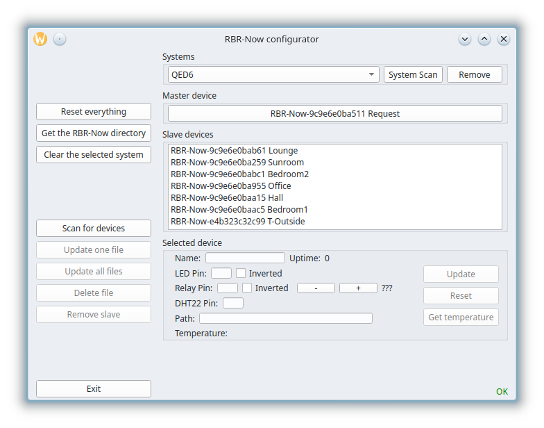

# RBR-Now Configuration

RBR-Now is a collection of local devices, all powered by ESP32, that implement the ESP-Now networking protocol to accept commands from a central controller. Configuration is a fairly complex procedure, so a special tool has been built to automate the process.

## Overview

Each RBR-Now device is programmed with the same set of MicroPython files, and the way it uses these files is determined by a configuration file `config.json` stored on the device.

The RBR network comprises a central hub, or “master” device, that connects to the local LAN and receives commands from the system controller. All the other devices are “slaves” that receive messages from the master device.

By default, each RBR-Now device starts up as a slave. On the first startup it creates its own `config.json` file, with the following content (subject to future revision):

```
{
    "pins": {
        "led": {
            "pin": "",
            "invert": false
        },
        "dht22": {
            "pin": ""
        },
        "relay": {
            "pin": "",
            "invert": false
        }
    },
    "master": false,
    "name": "(none)",
    "channel": 1
}
```

The device also sets up a wifi access point with the SSID RBR-Now-xxxxxxxxxxxx, where xxxxxxxxxxxx is the MAC address of the device. The password is 00000000 and the IP address of the device on its network is 192.168.9.1. This allows a browser to contact the device to perform further configuration. The device can then be sent a reboot command to act on the configuration given.

ESP-Now requires a device to have an active wifi connection, but the access point is essentially open, which is a major security hazard. For this reason, after 2 minutes the SSID of the access point changes to - and the password to a random number, so although it is still active the device is virtually inaccessible, all the more so because all devices have the same SSID. The implication of this is that after 2 minutes the only way to communicate with an RBR-Now device is via the system’s master device.

The master device has a slightly more complex configuration. When first set up it will be passed the SSID and password of the network it is to connect to (the home router). After a reset it then connects to that network as a client and receives an IP address that will subsequently be used for all communications between the system controller and the RBR-Now device network.

## System prerequisites ##

To run the configurator you will need EasyCoder. This should have been set up when the RBR software was installed, but if not you  can run

```
pip install -U easycoder
```

where the `-U` option makes sure that any older version you may have will be updated to the latest. EasyCoder will install in `~/.local/bin`, which may not be on your execution path. You can either adjust this (e.g. in `.profile`), or give the full path when you run EasyCoder, or set up an alias using the `ln` system command such as:

```
ln -s ~/.local/bin/easycoder ec
```

Next, create a text file `rbrconf.ecs` containing the following:

```
!   RBR-Now configuration

   script RBRConfig

   variable Script
   module RBRConfig

   get Script from url `https://raw.githubusercontent.com/easycoder/rbr/refs/heads/main/rbrconf.ecs`
   save Script to `.rbrconf.ecs`
   run `.rbrconf.ecs` as RBRConfig
   delete file `.rbrconf.ecs`
   exit
```

The line `get Script from url …` is a single line. It probably shows wrapped in the listing above.

Now issue this command:

```
easycoder rbrconf.ecs
```

## The system configurator ##

The configuration is a GUI application written in EasyCoder for Python. It runs exclusively on Linux because it requires the use of commands that are not available on Windows. Here is a screenshot of the application under development:
<br/>



When first started up, the configurator identifies the networkthe computer is currently connected to, and asks for the wifi password (as this cannot be obtained any other way). It also asks for the directory containing the Micropython source files for the RBR-Now devices, so that updates can be applied if needed. The requested path is relative to your home folder, not to the system root.

# Overview of the configurator #

I'll start by outlining the primary features of the configurator, before decribing in detail how to set up a network of devices using the tool.

## Finding RBR systems ##

Initially, the only button that is enabled is “System Scan”. This performs a scan of the network to discover RBR system controllers. Each of these runs an access point on an obscure port number, that responds to a specific request by returning its name, MAC address and password for accessing the RBR web server. With this information, the configurator contacts the server and downloads the current configuration information (if any) held for that system. As can be seen above, the UI is populated with this information. The system scan takes around 5 minutes as it has to check every IP address from 1 through 254.

The configurator can handle any number of systems, even if they are not all on the same network. The Systems dropdown box holds a list of names, and when one is selected the configurator checks if the network for that system matches the one the user's computer is currently on. If not, it offers to reconnect to the system’s network (if it’s accessible). Note that this has no effect on the RBR devices themselves. There's also a Cancel option which does nothing, but this will leave you unable to access the devices on the selected system.

All configurator functions that make changes to the information held will require confirmation from the user, so it is generally quite safe to experiment with the buttons. Note also that while the configurator is running, the system controller on the selected system is prevented from running. This lets you turn relays on and off manually from the configurator without the system controller immediately overriding your actions.

## Finding RBR-Now devices ##

With the appropriate system selected, the “Scan for devices” button searches the current network for RBR-Now devices, each of which has an SSID starting with RBR-Now-, as described in the Overview above. A list is then presented to the user, who selects one. The first time this is done for a system, the chosen device will become the master. The configurator connects to the device’s access point and sends it a new `config.json`, which includes the SSID and password of the network router. It then requests the device to reset and waits for 10 seconds for this to happen. When the device restarts it connects to the network and gets an IP address that the system controller will need, so the configurator now sends a request to the device for this address, which is added to the system configuration and sent back to the server.

A slave device requires none of the above configuration. Once selected it just goes into the “Slave devices” list.

## Working with devices ##

The user can select the master device or any one of the slaves by clicking its name. This causes the current configuration of the device to be copied into the “Selected device” fields. Here you set the name of the device and the pin numbers it uses for the LED, relay and thermometer (other fields may be added in future). Every time you interact with the device you will see the “Uptime” value increase, confirming that the device is active.

Once changes have been made, clicking the “Update” button writes the changed configuration back to the device.

If the device is driving a relay you can turn this on and off by clicking the appropriate button.

## Information storage ##

The configurator creates a hidden file `.rbr.conf` in the users’ home directory, containing all the currently known information about the systems being managed and the devices they contain. Each of the systems managed has its own configuration file on the RBR webserver; this is copied over when a system is accessed in the UI, and replaces that part of the local file. This is to permit changes to be made on different computers; the UI will always use the most recent data.

# A walk-through of the setup process #

Let's imagine a system with 4 rooms; Kitchen, Lounge, Bedroom 1 and Bedroom 2. Each of these has a single radiator, which is controlled by an electric TRV powered by an RBR-Now relay box. Let's suppose the system controller is in the kitchen, so it makes sense for the Master device is the one next to the kitchen radiator. All the other roooms are assumed to be close enough for the wireless signals to reach from the kitchen.

I assume you've already built the relay boxes, flashed them with Micropython and loaded the RBR-Now Python scripts onto them. If you need more information about doing this, [see here](setup-hardware.md). 

