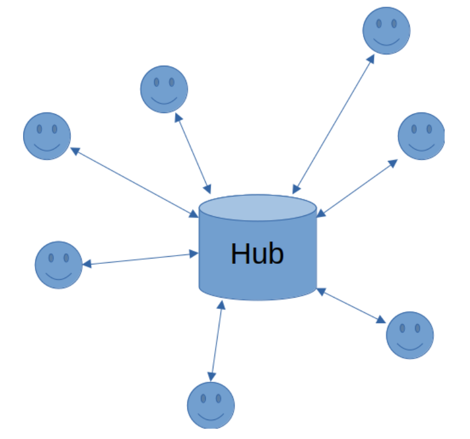
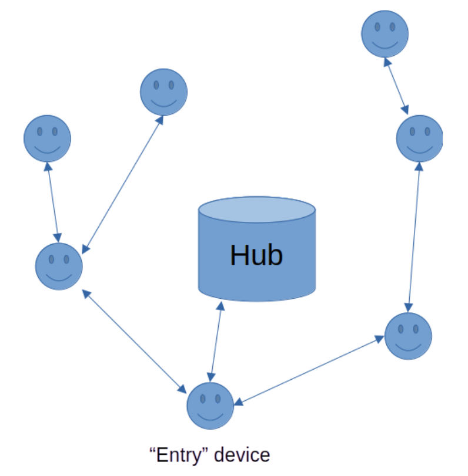

# The XR Relay
The XR (eXtended Relay) employs a wifi networking strategy for controlling simple devices distributed over a large physical area, without the need for repeaters. The code is Micropython and the system was designed for a network of 4MB ESP8266 devices. A typical target application would be monitoring and control of a commercial irrigation system, but the approach is equally well suited to handling the needs of domestic or industrial central heating systems.
## The problem
Most small-scale WiFi networking systems adopt a “star” topology:



with all the control and sensor nodes connected to a single hub; often a standard internet router. This will be located close to where the service provider's cable enters the property, often in a remote corner. Devices such as the ESP8266 have small antennae and operate poorly over anything more than quite a short distance. This is a problem that shows up as  delays in responding, frequent resets and even crashes, but which may not reveal itself until the installation has been completed and signed off.

This problem can be overcome by the use of extra routers or network extenders, but these may be visually intrusive and they add extra cost and complexity to the system.

A secondary issue concerns updates to the firmware inside the devices. When updates are required it is often necessary to manually visit each device in turn and perform an update.

This article describes a simple, low-cost approach where the controlled devices themselves take care of all the networking. It can handle a large number of devices and can be deployed using very modest hardware such as an ESP8266. The system connects to its controller through a single wifi address and can be completely configured and tested before delivery for installation.
## Outline
The strategy is to use some of the networked devices as message relays handing data to and from other nearby devices. The network then looks like this:



## Implementation
The strategy is based on a packet of information constructed by the system controller. Encoded as JSON, this contains a section for each of the networked devices, keyed by the name of the device. It also contains the current timestamp and the version number of the system firmware. Let's call this packet the “map”. Here’s an example of a simple system with two relay nodes:

`{“Room1“: {“relay“: “off“}, “Room2“: {“relay“: “on“}, “ts“: “1719094849“, “v“: “90“}`

The content of each device section in the map depends on the device. A relay has its state, on or off. A thermometer usually requires no information since its job is to return data, not consume it.

A single device such as a relay or a thermometer is designated as the entry point to the network. It connects to the access point (wifi hotspot) published by the system controller. It knows nothing of its role; it behaves just like every other node. The reason for having a single entry node is so the hub doesn’t have to combine messages coming from a variety of sources. Once connected, the entry device polls the hub at regular intervals such as every 10 seconds and the hub responds by sending it the map. The device looks in the map for its own name and extracts its data to perform whatever tasks are needed. For a relay this will tell it to turn on or off. For a thermometer, no actions are needed at this stage.

The next step is for the device to construct a return data packet. All devices add their most recently received timestamp to this packet. For a relay, that's all there is; a thermometer also adds the current temperature. The return packet looks like this:

`{“Room1“: {“ts”: “1719094849”}}`
or
`{“Thermo1“: {“temp”: “25.3”, “ts”: “1719094849”}}`

The return packet is sent back to the system hub on the next poll. If polling stops or if the timestamps don't get updated, the controller knows there's something wrong in the system by checking the ages of the returning timestamps.
## Adding more devices
Devices like the ESP8266 and ESP32 can operate simultaneously in Station and in Access Point mode. That is, they can connect to a wifi hotspot while at the same time publishing one of their own. These local hotspots have limited functionality but can usually support up to 4 connections, which allows us to expand the system by connecting devices to each other in a chain rather than all to a central hub. In this system, each device sets up a hotspot with an SSID based on its own MAC address and using a network IP address that's different to the one it’s connected to.

When a device receives a polling request from a client, it returns to that client the map it got from its own poll. The data packet that accompanied the client poll is opened and its contents are added to the packet that will be sent back on the device's own next poll. So the return packet will expand to look like this:

`{“Room1“: {“ts”: “1719094849”}, “Room2“: {“ts”: “1719093995”}}`

Each subsequent device added to the system is set up to connect not directly to the system hub but to an already configured device. The behaviour of every device is identical so it’s very easy to configure the system; the device name and its parent SSID are the only items that differ from one device to another. And so the system grows, with devices being connected to any other device that can offer a good wifi signal, up to a limit of 4 connections per device.
## Over The Air (OTA) updates
The version number handed out by the hub is used to keep the system firmware up to date. Each device keeps a note of its current version. When a message packet arrives with a higher version number, the device requests a list of files from its parent, then requests each of the files listed, one by one. Once it has finished updating it saves the new version number.

While updating is taking place, normal operation is suspended. Clients of a device will not get responses to their polling and will eventually time out and reset themselves. Once updating has finished the device will restart normal operation and when it receives the map from its parent will pass it on. Since this now contains an updated version number, each of its clients will start their own update. So the latest version ripples through the system and everyone ends up with the same code.

If the system is a mix of different device types, the code for all of them must be contained in each. So a relay contains thermometer code and vice versa.
## Upsides
 - Ability to handle a large number of devices spread over a large physical area
 - No wifi black spots
 - Very low cost
## Downsides
The main downside of this system is the time it takes messages to propagate through the network. It's not suitable for use where a rapid response is needed, as response times are measured in seconds or even tens of seconds. There are however many applications for which this is not a problem, ranging from home heating to large-scale irrigation.
# The code
The code described in these pages is all Micropython. The device on which it runs, typically an ESP8266, must have at least 4M bytes of flash memory in order to support the full set of modules required. If you are using the ESP-01 be sure to get the 4MB version, not the older 1MB.

The firmware has 3 modes of operation:

 - Unconfigured
 - Configured
 - Updating

As with all Micropython projects there is a boot file and a main program. First, `boot.py`:
```
from machine import Pin

led = Pin(2, Pin.OUT)
led.on()

import esp
esp.osdebug(None)

import gc
gc.collect()
```
This is pretty standard. Next, `main.py`, which will always run automatically following `boot.py`:
```
import os

def fileExists(filename):
    try:
        os.stat(filename)
        return True
    except OSError:
        return False

if fileExists('config.json'):
    if fileExists('update'):
        import updater
        f = open('update','r')
        value=f.read()
        f.close()
        updater.run(value)
    else:
        import configured
        configured.run()
else:
    import unconfigured
    unconfigured.run()
```
The operating mode is determined by a couple of files in the device flash. The file `config.json` contains information specific to this device. If this file does not exist the device is unconfigured; if it exists then the device is considered to be configured and ready to run. In the latter case, the file update is checked; if it exists the device enters update mode, which I’ll cover last.

[Unconfigured mode](unconfigured.md)

[Configured mode](configured.md)

[Update mode](update.md)

