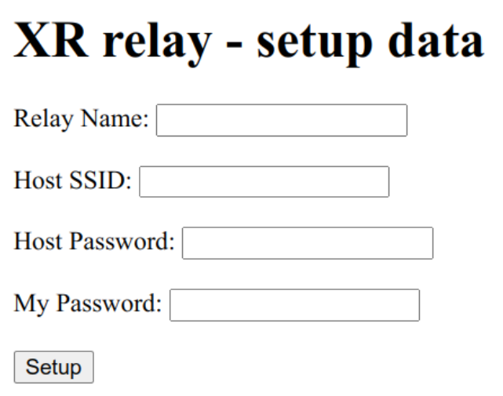

## Unconfigured mode
This mode is handled by `unconfigured.py`. This mode is optional; if you provide a `config.json` file from the outset the device will never run unconfigured. It exists so that a batch of devices can be flashed with identical firmware and then each one configured individually using a browser. Here’s the code:
```
# Import necessary modules
import network,asyncio,socket,ubinascii,time,machine,json
from machine import Pin

configHTML='''
<!DOCTYPE html>
<html>
<body>
	<h1>XR relay - setup data</h1>
	<form action="/setup" method="get">
		<label>Relay Name:</label>
		<input type="text" id="name"
			name="Relay Name"><br><br>

		<label>Host SSID:</label>
		<input type="text" id="hostssid"
			name="Host SSID"><br><br>

		<label>Host Password:</label>
		<input type="text" id="hostpass"
			name="Host Password"><br><br>

		<label>My Password:</label>
		<input type="text" id="mypass"
			name="My Password"><br><br>

		<input type="submit" value="Setup">
	</form>
</body>
</html>
'''

ackHTML='''
<!DOCTYPE html>
<html>
<body>
	<h1>Relay is now configured and will restart</h1>
</body>
</html>
'''

def info():
    print('This handles unconfigured mode')

led_blink = Pin(2, Pin.OUT)

# Asynchronous function to handle client's requests
async def handle_client(reader, writer):
    global ap,myssid
    config={}
    # Write a config element
    def writeConfigElement(item):
        key,value=item.split('=',1)
        if key=='Relay+Name':
            config['myname']=value
            return True
        elif key=='Host+SSID':
            config['hostssid']=value
            return True
        elif key=='Host+Password':
            config['hostpass']=value
            return True
        elif key=='My+Password':
            config['mypass']=value
            return True
        return False

    request_line = await reader.readline()
#    print('Request:', request_line)

    # Skip HTTP request headers
    while await reader.readline() != b"\r\n":
        pass

    request = str(request_line, 'utf-8').split()[1]
#    print('Request:', request)

    req=request.split('?')
    cmd=req[0].split('/')
    cmd=cmd[len(cmd)-1]
    if len(req)>1:
        args=req[1].split()
        args=args[0].replace('%27','\'')
    else:
        args=None
    print(cmd,args)

    # Generate HTML response
    resetRequest=False
    response = 'OK'
    if cmd is 'config':
        response=configHTML
    elif cmd is 'setup':
        items=args.split('&')
        for item in items:
            writeConfigElement(item)
            await asyncio.sleep(1)
        f = open('config.json', 'w')
        f.write(json.dumps(config))
        f.close()

        await asyncio.sleep(1)
        response=ackHTML
        resetRequest=True
    else:
        try:
            rssi=ap.status('rssi')
        except:
            rssi=''
        response=f'SSID: {myssid} {rssi}'

    # Send the HTTP response and close the connection
    writer.write('HTTP/1.0 200 OK\r\nContent-type: text/html\r\n\r\n')
    writer.write('<!DOCTYPE HTML><html lang="en"><head></head><body>'+response+'</body></html>')
    await writer.drain()
    await writer.wait_closed()
    if resetRequest:
        await asyncio.sleep(1)
        machine.reset()

async def blink():
    while True:
        led_blink.on()  # Toggle LED state
        await asyncio.sleep(0.5)  # Blink interval
        led_blink.off()  # Toggle LED state
        await asyncio.sleep(0.5)  # Blink interval

async def main():
    global ap,myssid
    ap=network.WLAN(network.AP_IF)
    myssid='RBR-xr-' + ubinascii.hexlify(ap.config('mac')).decode()[6:]
    print('Set up AP for',myssid)
    ap.active(True)
    ap.config(essid=myssid, authmode=3, password='00000000')
    ap.ifconfig(('192.168.66.1', '255.255.255.0', '192.168.66.1', '8.8.8.8'))

    timeout=60
    while not ap.active():
        await asyncio.sleep(1)
        timeout-=1
        if timeout==0:
            print('\nCan\'t set up AP')
            await asyncio.sleep(1)
            machine.reset()

    # Start the server and run the event loop
    server = asyncio.start_server(handle_client, "0.0.0.0", 80)
    asyncio.create_task(server)
    print('Server running')
    asyncio.create_task(blink())

    while True:
        await asyncio.sleep(10)

def run():
    print('Unconfigured')
    asyncio.create_task(main())
    asyncio.get_event_loop().run_forever()

run()
```
The job of this module is to run a web server that offers a configuration form for the user to supply configuration data. At the top are a couple of HTML pages, then some utility functions and finally the main code.

The key feature here is the use of asynchronous functions to permit multitasking. The program runs 2 jobs; one waits for a client to connect and the other flashes the LED. Since neither of these can be allowed to block, asynchronous code is needed. The first thing is to create the two tasks, using asyncio, then enter an endless loop while they perform their duties.

The code sets up a webserver whose SSID is of the form `RBR-xr-xxxxxx`, where `xxxxxx` are the last 6 digits of the device MAC address. The IP address of the server is `192.168.66.1`. Connecting to it at `http://192.168.66.1/config` brings up the following screen:



The fields are as follows:

**Relay Name**: Any name that uniquely identifies this relay in the network. Spaces are not allowed.
**Host SSID**: The SSID of the device this one should connect to.
**Host Password**: The Wifi password of the host.
**My Password**: The Wifi password that will allow access to the server on this device once configured.

When **Setup** is clicked the fields are combined into a JSON structure and saved into the device flash area as `config.json`. Then the device resets itself. If all is well it should restart in Configured mode.

[Configured mode](XR/doc/configured.md)

[Update mode](XR/doc/update.md)

[Back to start](XR/doc/README.md)
